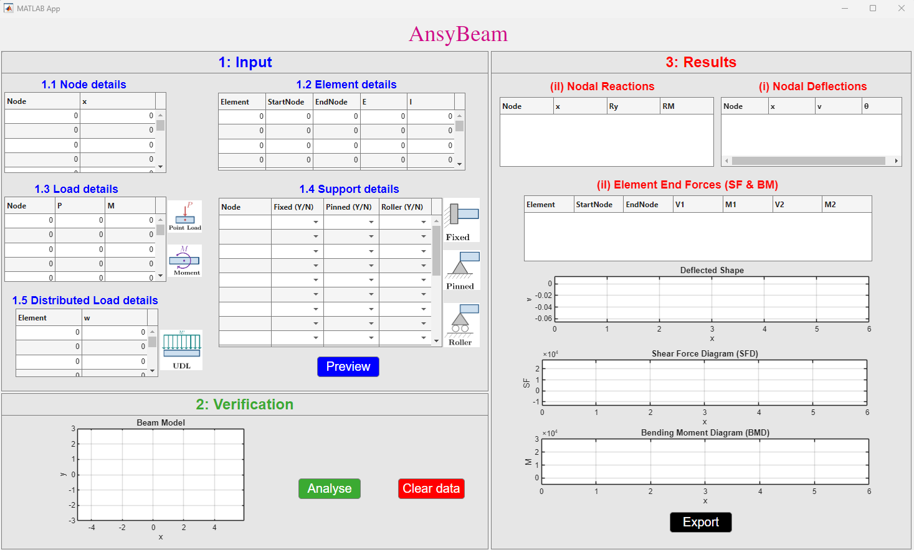
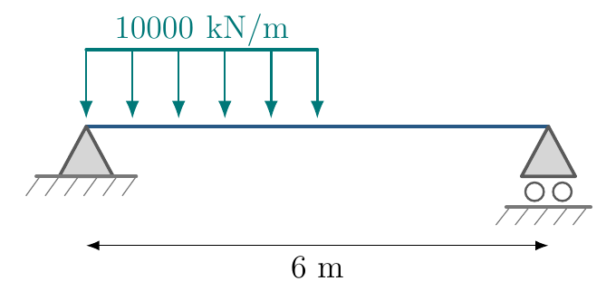
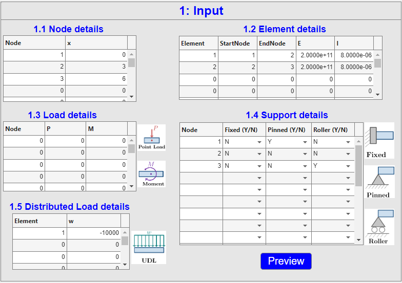
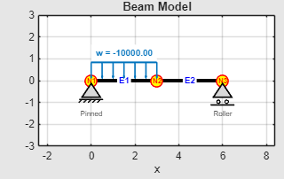
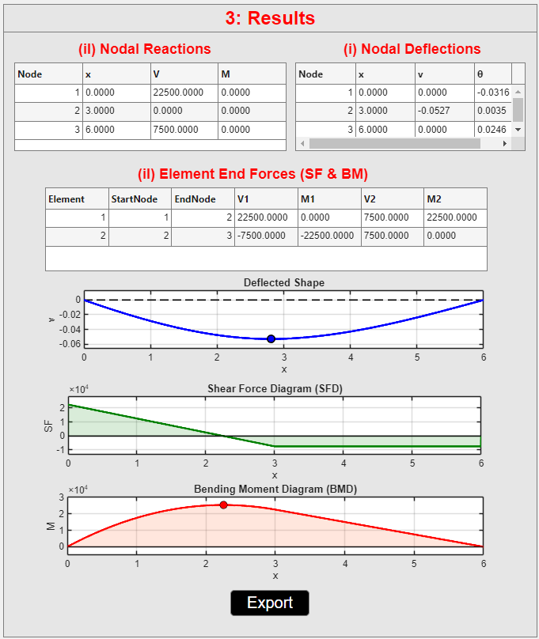

  

# AnsyBeam v1.0.0

**AnsyBeam** is a MATLAB-based educational tool for interactive planar Euler--Bernoulli beam analysis, visualisation, and reporting.

The tool is designed to support teaching and learning in structural analysis by allowing students to define, verify, analyse, and visualise simple beam structures.

## Purpose

AnsyBeam was developed to help students connect theoretical beam analysis concepts with visual and computational results. It provides an interactive environment where users can enter beam data, modify models, observe structural behaviour, and generate analysis reports.

## Main Features

- Define beam node coordinates
- Define beam elements
- Assign material and section properties
- Assign support conditions
- Apply nodal point loads and nodal moments
- Apply uniformly distributed loads
- Verify beam geometry before analysis
- Analyse planar Euler--Bernoulli beam structures
- View nodal deflections, rotations, support reactions, shear forces, and bending moments
- Visualise shear force diagrams, bending moment diagrams, and deflected beam shapes
- Export PDF analysis reports

## Downloads

Download the latest version from the [GitHub Releases page](https://github.com/ComputationalMechanicsLab-AUT/AnsyBeam/releases).

Available package includes:

- Windows standalone installer: `AnsyBeam_Windows_Installer.exe`

> MATLAB source code is not publicly distributed in this repository.

## Documentation

- [User Manual](docs/AnsyBeam_user_manual.pdf)

## Example Report

- [Sample PDF Report](examples/AnsyBeam_Report.pdf)

## Screenshots

### GUI Overview

### Sample Model

### Input Data

### Verification Geometry

### Analysis Results

## Copyright

© 2026 Auckland University of Technology (AUT). All rights reserved.
