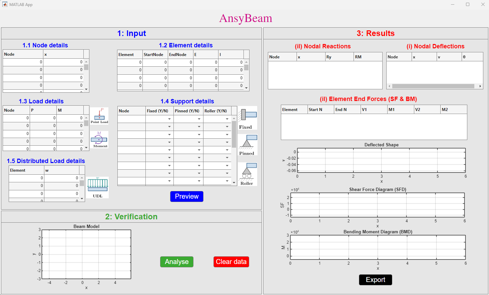
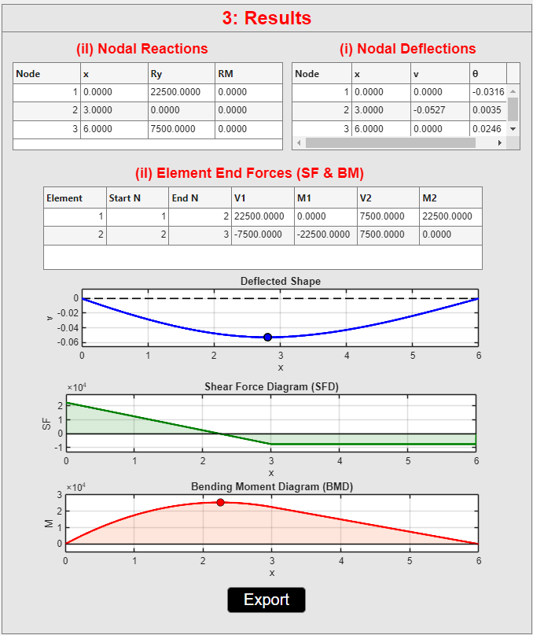

  

# AnsyBeam v1.0.0

**AnsyBeam** is a MATLAB-based educational tool for interactive analysis, visualisation, and reporting of planar Euler–Bernoulli beams.

The tool is designed to support teaching and learning in structural analysis by allowing students to define, verify, analyse, and visualise simple beam structures.

It is intended for students, educators, and anyone learning or demonstrating fundamental beam-analysis concepts.
## Purpose

AnsyBeam was developed to help students connect theoretical beam analysis concepts with visual and computational results. It provides an interactive environment where users can enter beam data, modify models, observe structural behaviour, and generate analysis reports.

## Main Features

- Define beam node coordinates
- Define beam elements
- Assign material and section properties
- Assign support conditions
- Apply nodal point loads and nodal moments
- Apply uniformly distributed loads
- Verify beam geometry before analysis
- Analyse planar Euler-Bernoulli beam structures
- View nodal deflections, rotations, support reactions, shear forces, and bending moments
- Visualise shear force diagrams, bending moment diagrams, and deflected beam shapes
- Export PDF analysis reports

## Downloads

Download the latest version from the [GitHub Releases page](https://github.com/ComputationalMechanicsLab-AUT/AnsyBeam/releases).

Available packages include:

- Windows standalone installer: `AnsyBeam_Windows_Installer.exe`
- macOS standalone installer: `AnsyBeam_macOS_Installer.zip`

> MATLAB source code is not publicly distributed in this repository.
> 
## Quick Start

1. Download the appropriate installer from the [latest release](https://github.com/ComputationalMechanicsLab-AUT/AnsyBeam/releases).

   - Windows: `AnsyBeam_Windows_Installer.exe`
   - macOS: `AnsyBeam_macOS_Installer.zip`
  
2. Run the installer on a Windows computer.
3. Open AnsyBeam and refer to the [User Manual](docs/AnsyBeam_user_manual.pdf).
4. Use the sample model and report as a guide to creating and analysing a beam model.

## Documentation

- [User Manual](docs/AnsyBeam_user_manual.pdf)

## Example Report

- [Sample PDF Report](examples/AnsyBeam_Report.pdf)

## Screenshots

### GUI Overview

### Sample Model

### Input Data

### Verification Geometry

### Analysis Results

## Intended Use and Limitations

AnsyBeam is intended for educational use, teaching demonstrations, and learning activities in structural analysis. It is not a substitute for professional
engineering analysis, design software, independent verification, or engineering judgement.

The current implementation considers planar Euler–Bernoulli beam models.
Users should confirm that modelling assumptions, boundary conditions, material properties, units, and loading are appropriate for their application.

## Copyright

Developed by Dr Vaishakh Kottila Veedu, Auckland University of Technology (AUT).

Copyright © 2026 Vaishakh Kottila Veedu. All rights reserved.
